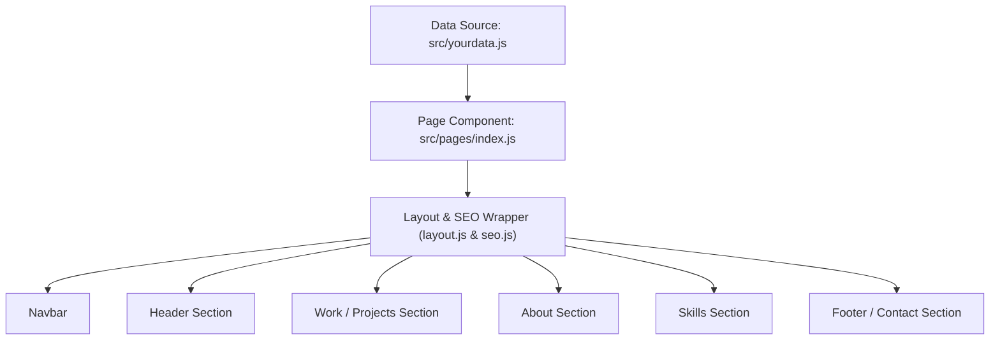

## Modify website
  1. Change code from branch dev and push it
  2. For deploy type npm run deploy in git bash VS code
  3. Setting github pages for change branch to " gh-pages "
  
  for detail tutorial please [Click Me](https://dev.to/yuribenjamin/how-to-deploy-react-app-in-github-pages-2a1f)

#### Personalize page content in `/src/yourdata.js` & modify it as per your need.


## Technologies Used 

- [React](https://reactjs.org/)
- [Gatsby](https://www.gatsbyjs.com/)

---

## 📘 Project Overview & Architecture

Project ini adalah website portofolio berbasis **Gatsby v5** (React 18) yang dirancang secara statis (*Static Site Generation*) dan di-host menggunakan **GitHub Pages**. Seluruh data konten portofolio dipisahkan secara terpusat di satu file konfigurasi (`src/yourdata.js`) untuk kemudahan kustomisasi.

---

## 🔄 App Flow (Alur Aplikasi)



1. **Penyimpanan Data**: Pengguna cukup memperbarui data portofolio (nama, bio, karya/projek, keahlian, dan tautan media sosial) di file `src/yourdata.js`.
2. **Perakitan Halaman**: File `src/pages/index.js` mengimpor data tersebut dan me-render komponen-komponen utama (`Header`, `Work`, `About`, `Skills`, `Footer`).
3. **Pengayaan Visual & Animasi**: Komponen menggunakan animasi transisi (`react-reveal`) dan penataan gaya modular berbasis Sass (`src/styles/mains.scss`).
4. **Navigasi Halus**: Komponen `Navbar` menyediakan smooth-scroll langsung menuju section yang dituju (`#home`, `#work`, `#about`, `#skills`).
5. **Static Building**: Saat proses `npm run build`, Gatsby mengompilasi seluruh React komponen dan SCSS menjadi file HTML/CSS/JS statis yang dioptimalkan di folder `public/`.

---

## 📁 Code Structure (Struktur Folder)

```text
alfatayah.github.io/
├── public/                 # Hasil build statis untuk produksi
├── src/
│   ├── components/         # Komponen UI modular
│   │   ├── atoms/          # Komponen atom kecil (misal: Card.js)
│   │   ├── Header.js       # Section perkenalan & salam utama
│   │   ├── Work.js         # Section daftar projek / karya
│   │   ├── about.js        # Section deskripsi diri & bio
│   │   ├── skills.js       # Section daftar keahlian / ikon teknologi
│   │   ├── Footer.js       # Section kontak & tautan sosial
│   │   ├── Navbar.js       # Bar navigasi atas (smooth scroll)
│   │   ├── layout.js       # Pembungkus layout global
│   │   └── seo.js          # Pengaturan meta tag & SEO
│   ├── images/             # Asset gambar & ikon SVG/PNG
│   ├── pages/              # Halaman rute Gatsby
│   │   ├── index.js        # Halaman utama portofolio
│   │   └── 404.js          # Halaman error 404
│   ├── styles/             # Stylesheet SCSS modular
│   │   ├── mains.scss      # Main SCSS entry point
│   │   ├── header.scss     # Style section header
│   │   ├── work.scss       # Style section work & cards
│   │   ├── navbar.scss     # Style navigasi
│   │   ├── card.scss       # Style komponen kartu projek
│   │   └── include-media.scss # Utility breakpoint responsif
│   └── yourdata.js         # File konfigurasi data utama pengguna
├── gatsby-config.js        # Konfigurasi plugin Gatsby & metadata situs
├── gatsby-node.js          # Konfigurasi node & build kustom Gatsby
├── package.json            # Konfigurasi dependensi & npm scripts
└── .gitignore              # Daftar file/folder yang diabaikan Git
```

---

## 🚀 Deployment Guide (Panduan Deploy)

Website ini dideploy menggunakan paket `gh-pages` langsung ke cabang `gh-pages` di GitHub Repository.

### 1. Pengembangan Lokal (Development)
Menjalankan server lokal untuk preview saat pengkodean:
```bash
npm run start
# atau
npm run develop
```
Buka browser di `http://localhost:8000`.

### 2. Membangun Proyek (Build)
Menguji proses build statis secara lokal:
```bash
npm run build
```

### 3. Deploy ke GitHub Pages
Untuk mempublikasikan pembaruan ke web (`https://alfatayah.github.io`):
```bash
npm run deploy
```
*Catatan: Perintah `npm run deploy` secara otomatis memicu `predeploy` (`npm run build`) lalu mengunggah folder `public/` ke branch `gh-pages` di GitHub.*

