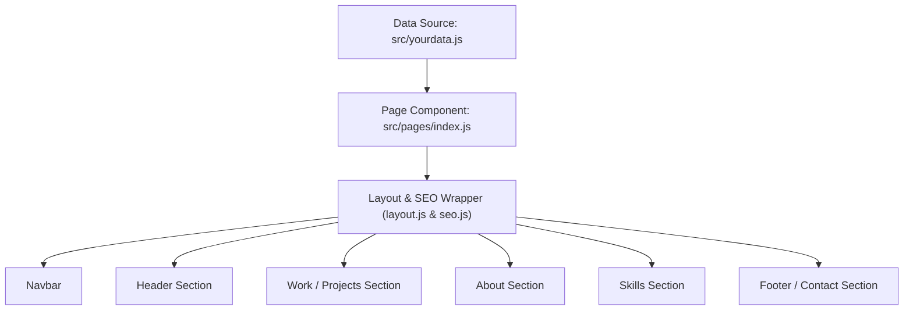

## Modify website
  1. Change code from branch dev and push it
  2. For deploy type npm run deploy in git bash VS code
  3. Setting github pages for change branch to " gh-pages "
  
  for detail tutorial please [Click Me](https://dev.to/yuribenjamin/how-to-deploy-react-app-in-github-pages-2a1f)

#### Personalize page content in `/src/yourdata.js` & modify it as per your need.


## Technologies Used 

- [React](https://reactjs.org/)
- [Gatsby](https://www.gatsbyjs.com/)

---

## 📘 Project Overview & Architecture

Project ini adalah website portofolio berbasis **Gatsby v5** (React 18) yang dirancang secara statis (*Static Site Generation*) dan di-host menggunakan **GitHub Pages**. Seluruh data konten portofolio dipisahkan secara terpusat di satu file konfigurasi (`src/yourdata.js`) untuk kemudahan kustomisasi.

---

## 🔄 App Flow (Alur Aplikasi)



1. **Penyimpanan Data**: Pengguna cukup memperbarui data portofolio (nama, bio, karya/projek, keahlian, dan tautan media sosial) di file `src/yourdata.js`.
2. **Perakitan Halaman**: File `src/pages/index.js` mengimpor data tersebut dan me-render komponen-komponen utama (`Header`, `Work`, `About`, `Skills`, `Footer`).
3. **Pengayaan Visual & Animasi**: Komponen menggunakan animasi transisi (`react-reveal`) dan penataan gaya modular berbasis Sass (`src/styles/mains.scss`).
4. **Navigasi Halus**: Komponen `Navbar` menyediakan smooth-scroll langsung menuju section yang dituju (`#home`, `#work`, `#about`, `#skills`).
5. **Static Building**: Saat proses `npm run build`, Gatsby mengompilasi seluruh React komponen dan SCSS menjadi file HTML/CSS/JS statis yang dioptimalkan di folder `public/`.

---

## 📁 Code Structure (Struktur Folder)

```text
alfatayah.github.io/
├── public/                 # Hasil build statis untuk produksi
├── src/
│   ├── components/         # Komponen UI modular
│   │   ├── atoms/          # Komponen atom kecil (misal: Card.js)
│   │   ├── Header.js       # Section perkenalan & salam utama
│   │   ├── Work.js         # Section daftar projek / karya
│   │   ├── about.js        # Section deskripsi diri & bio
│   │   ├── skills.js       # Section daftar keahlian / ikon teknologi
│   │   ├── Footer.js       # Section kontak & tautan sosial
│   │   ├── Navbar.js       # Bar navigasi atas (smooth scroll)
│   │   ├── layout.js       # Pembungkus layout global
│   │   └── seo.js          # Pengaturan meta tag & SEO
│   ├── images/             # Asset gambar & ikon SVG/PNG
│   ├── pages/              # Halaman rute Gatsby
│   │   ├── index.js        # Halaman utama portofolio
│   │   └── 404.js          # Halaman error 404
│   ├── styles/             # Stylesheet SCSS modular
│   │   ├── mains.scss      # Main SCSS entry point
│   │   ├── header.scss     # Style section header
│   │   ├── work.scss       # Style section work & cards
│   │   ├── navbar.scss     # Style navigasi
│   │   ├── card.scss       # Style komponen kartu projek
│   │   └── include-media.scss # Utility breakpoint responsif
│   └── yourdata.js         # File konfigurasi data utama pengguna
├── gatsby-config.js        # Konfigurasi plugin Gatsby & metadata situs
├── gatsby-node.js          # Konfigurasi node & build kustom Gatsby
├── package.json            # Konfigurasi dependensi & npm scripts
└── .gitignore              # Daftar file/folder yang diabaikan Git
```

---

## 🚀 Deployment Guide (Panduan Deploy ke GitHub Pages)

Tutorial ini diadaptasi dari panduan [How to deploy React App to GitHub Pages](https://dev.to/yuribenjamin/how-to-deploy-react-app-in-github-pages-2a1f) oleh Yuri Benjamin, dengan penyesuaian untuk arsitektur **Gatsby/React** pada proyek ini.

### 📋 1. Prasyarat (Prerequisites)
- Akun GitHub & Git terinstal dan terkonfigurasi di komputer (`git --version`).
- Node.js & Npm terinstal (`node -v` & `npm -v`).
- Paket [`gh-pages`](https://www.npmjs.com/package/gh-pages) sudah terinstal sebagai *dev-dependency* di dalam proyek (`npm install gh-pages --save-dev`).

### ⚙️ 2. Konfigurasi `package.json`
Proyek ini membutuhkan 2 konfigurasi utama di dalam [`package.json`](file:///d:/Repo/alfatayah.github.io/package.json) agar deploy berjalan otomatis:
1. **Properti `homepage`**: Menentukan URL situs GitHub Pages Anda.
   ```json
   "homepage": "https://alfatayah.github.io"
   ```
2. **Properti `scripts` (`predeploy` & `deploy`)**:
   ```json
   "scripts": {
     "predeploy": "npm run build",
     "deploy": "gh-pages -d public"
   }
   ```
   *Catatan: Berbeda dengan Create React App yang menggunakan folder `build`, Gatsby menyimpan hasil kompilasi statis di folder `public/`, sehingga parameter yang digunakan adalah `-d public`.*

### 💻 3. Menjalankan & Menguji Secara Lokal (Local Development)
Sebelum melakukan deploy, uji tampilan website secara lokal:
```bash
# Menjalankan server pengembangan lokal (http://localhost:8000)
npm run develop

# Menguji proses build produksi statis di folder public/
npm run build
```

### 🌐 4. Proses Deploy ke GitHub Pages
Untuk mempublikasikan website agar *live* dan dapat diakses oleh publik:
1. Buka Git Bash atau Terminal di VS Code pada direktori proyek.
2. Jalankan perintah deploy:
   ```bash
   npm run deploy
   ```
3. **Alur di balik layar**: Perintah ini otomatis menjalankan `predeploy` (`npm run build` / `gatsby build`) terlebih dahulu untuk membuat bundel produksi statis, kemudian `gh-pages` akan mengunggah isi folder `public/` tersebut langsung ke branch **`gh-pages`** di GitHub Anda.

### 🔧 5. Pengaturan Repository di GitHub (GitHub Pages Settings)
1. Buka repositori proyek Anda di **GitHub.com**.
2. Masuk ke menu **Settings** ➡️ klik **Pages** pada sidebar kiri (di bawah bagian *Code and automation*).
3. Pada bagian **Build and deployment** ➡️ **Source**, pilih **Deploy from a branch**.
4. Pada bagian **Branch**, pilih branch **`gh-pages`** dan folder **`/ (root)`**, lalu klik **Save**.
5. Tunggu beberapa menit hingga proses publikasi selesai. Website Anda sekarang aktif di URL `homepage`!

### 📦 6. Menyimpan Kode Sumber (Commit & Push Source Code)
Branch `gh-pages` hanya khusus untuk file hasil *build* statis. Jangan lupa selalu menyimpan perubahan kode sumber Anda ke branch pengembangan utama (misal: `dev` atau `main`):
```bash
git add .
git commit -m "Pesan pembaruan website"
git push origin dev
```

